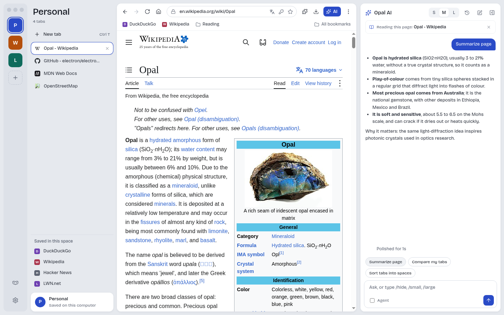
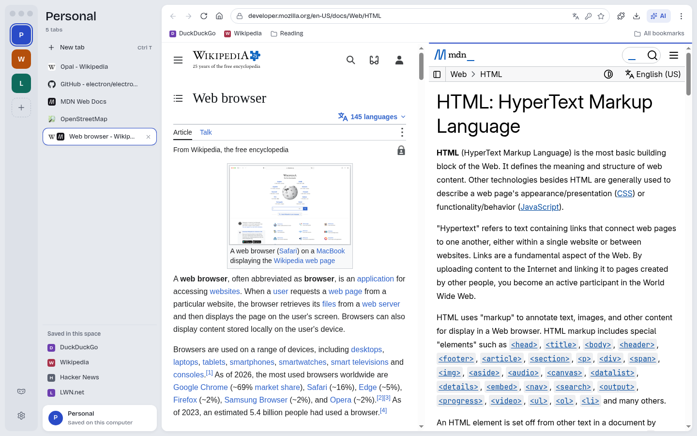
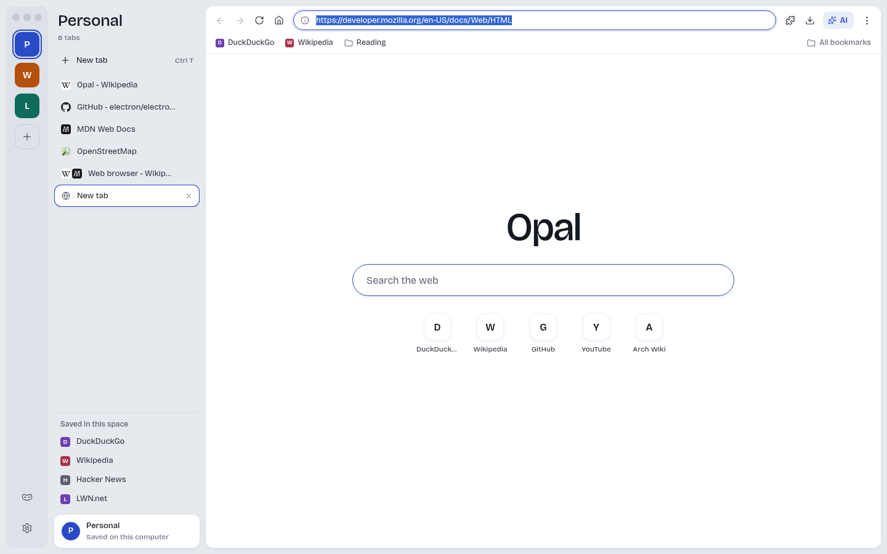
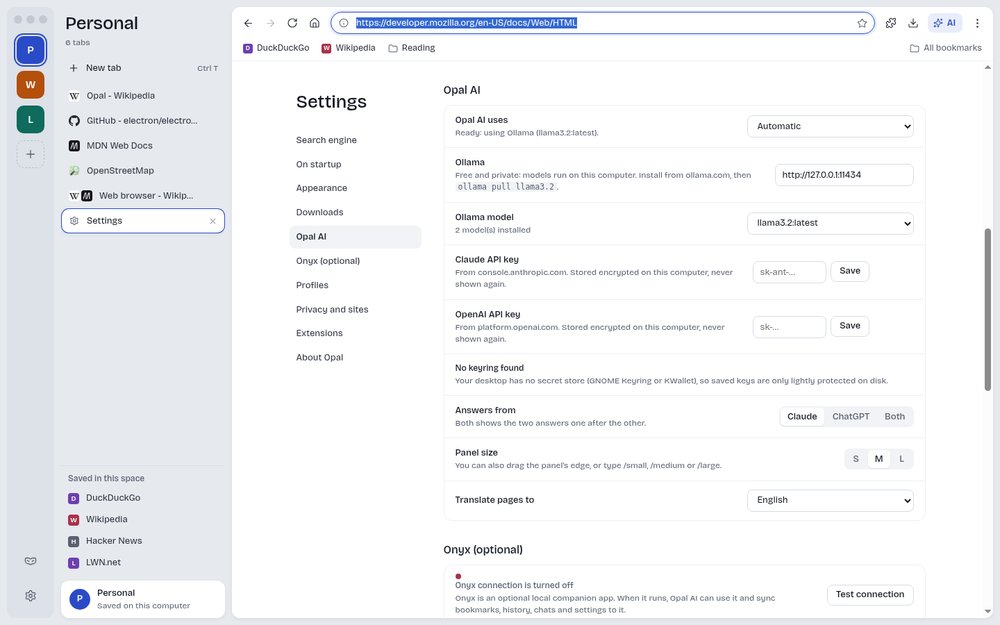

<p align="center">
  
</p>

<p align="center">A calm web browser for Linux, with spaces, vertical tabs and an optional AI assistant.</p>

<p align="center">
  <a href="https://github.com/nirwwan/opal-browser/releases/latest">Download</a> ·
  <a href="#install">Install</a> ·
  <a href="#opal-ai">Opal AI</a> ·
  <a href="#known-limitations">Known limitations</a> ·
  <a href="#build-from-source">Build from source</a>
</p>



<sub>Screenshots use a fresh demo profile. The AI answer above comes from Opal's demo backend (`scripts/mock-llm.js`), not a real model.</sub>

Opal is a desktop browser built on Chromium (through Electron). It aims for a quiet, focused layout:
a rail of **spaces**, each with its own tabs and bookmarks, a vertical tab list, and the page.
An optional **Opal AI** panel can read the page with you, but Opal is a complete browser without it.

## Features

- **Spaces**: separate sets of tabs and bookmarks (Personal, Work, …), each with its own colour.
- **Vertical tabs**, drag to reorder or move between spaces; reopen closed tabs; session restore after a crash.
- **Split view**: two pages side by side in one tab.
- **Reader mode** (Mozilla Readability), **picture in picture**, find in page, zoom, print and save as PDF.
- **Profiles** with separate storage, and **incognito** windows that keep nothing on disk.
- **Chrome Web Store extensions** with a toolbar menu (partial API support, see below).
- **Opal AI** (optional): ask about the page, summarize, compare your tabs, sort tabs into spaces,
  translate the page, and an **agent mode** that clicks, types and scrolls for you, showing each step,
  with a Stop button and a confirmation before it submits forms or pays for anything. It never types passwords.
- Search with Google, DuckDuckGo, Bing or Brave. Keyboard shortcuts like Chrome's, plus `Ctrl+K` for a command bar.
- Wayland and X11, x64 and arm64.

| Split view | New tab | Opal AI settings |
|---|---|---|
|  |  |  |

## Install

Download the file for your system from the [latest release](https://github.com/nirwwan/opal-browser/releases/latest).
`x64` / `amd64` / `x86_64` is for most PCs; `arm64` / `aarch64` is for ARM laptops and boards.
Every release has a `SHA256SUMS` file: `sha256sum --check --ignore-missing SHA256SUMS`.

| Package | Best for | Updates |
|---|---|---|
| `.deb` | Ubuntu, Debian, Linux Mint, Pop!_OS, elementary, ChromeOS Linux | with your system |
| `.rpm` | Fedora, openSUSE, RHEL / Rocky / Alma | with your system |
| `.AppImage` | any distribution, no install needed | automatic, from GitHub Releases |
| `.tar.gz` | manual installs, any distribution | by hand |

### Ubuntu, Debian and derivatives (.deb)

```sh
sudo apt install ./opal-browser_0.1.0_amd64.deb      # or _arm64.deb
```

Opal appears in your app launcher and as `opal` in the terminal. The package sets up Chromium's sandbox,
including an AppArmor profile on Ubuntu 23.10 and newer. Remove it with `sudo apt remove opal-browser`.

### Fedora, openSUSE, RHEL (.rpm)

```sh
sudo dnf install ./opal-browser-0.1.0.x86_64.rpm     # Fedora / RHEL (or .aarch64.rpm)
sudo zypper install ./opal-browser-0.1.0.x86_64.rpm  # openSUSE
```

### AppImage (any distribution)

```sh
chmod +x Opal-0.1.0-x86_64.AppImage
./Opal-0.1.0-x86_64.AppImage
```

The AppImage updates itself from GitHub Releases (you can turn this off in Settings). To add it to your
app launcher and make it the default browser, use **Settings → On startup → Make Opal the default**.
Ubuntu 23.10 and newer need one extra step for the sandbox, see [Sandbox](#sandbox).

### .tar.gz

```sh
tar xzf opal-0.1.0-linux-x64.tar.gz
cd opal-0.1.0-linux-x64          # the folder inside the archive
sudo chown root:root chrome-sandbox && sudo chmod 4755 chrome-sandbox   # once, for the sandbox
./opal
```

### Arch Linux, Manjaro and others

Use the AppImage or the `.tar.gz`. There is no AUR package yet.

### Flatpak

A Flatpak manifest is in [`packaging/flatpak`](packaging/flatpak) for building locally; Opal is not on Flathub yet.

## Wayland and X11

Opal picks Wayland automatically when your session uses it, and X11 otherwise. To force one:

```sh
opal --ozone-platform=x11
opal --ozone-platform=wayland
```

## Sandbox

Opal keeps Chromium's security sandbox on. It never turns it off by itself. If the sandbox can't start, Opal
shows a message with the fix instead of starting without it.

- **.deb / .rpm**: set up automatically.
- **AppImage on Ubuntu 23.10+** (AppArmor restricts user namespaces): add this profile once:

  ```sh
  sudo tee /etc/apparmor.d/opal-appimage >/dev/null <<'EOF'
  abi <abi/4.0>,
  include <tunables/global>

  profile opal-appimage /{,var/}tmp/.mount_*/opal-bin flags=(unconfined) {
    userns,
  }
  EOF
  sudo apparmor_parser -r /etc/apparmor.d/opal-appimage
  ```

  Or install the `.deb` instead.
- **.tar.gz**: `sudo chown root:root chrome-sandbox && sudo chmod 4755 chrome-sandbox` in the Opal folder.

Starting with `--no-sandbox` works but removes an important protection, so it isn't recommended.

## Opal AI

Opal AI is optional and off until you choose a backend in **Settings → Opal AI**. Opal never sends anything
anywhere until you set it up, and it only sends a page's text when you ask a question about it.

- **Ollama (free, private, no account)**: install [Ollama](https://ollama.com), then `ollama pull llama3.2`.
  Opal finds it on `http://127.0.0.1:11434` and lets you pick the model.
- **Your own API key**: paste a Claude key (from [console.anthropic.com](https://console.anthropic.com)) or an
  OpenAI key (from [platform.openai.com](https://platform.openai.com)). Keys are encrypted with your desktop's
  keyring (GNOME Keyring or KWallet) and never leave Opal's main process. Claude uses `claude-opus-5-5` by default;
  you can pick another model from the list. With both keys you can compare answers side by side.
- **Onyx**: if you use the Onyx editor, Opal can use its local server for AI and also sync bookmarks,
  history, chats and settings to it.

"Automatic" uses Onyx if it is running, then Ollama, then your saved keys.

## Known limitations

- **Chrome extensions are partly supported.** Many work (for example React Developer Tools, Vimium, Grammarly,
  SponsorBlock, Return YouTube Dislike, Wappalyzer). Some popular ones don't yet: MV3 content blockers such as
  uBlock Origin Lite can't block (no `declarativeNetRequest`), and extensions whose popups rely on their
  background service worker (Dark Reader, Bitwarden, 1Password, Privacy Badger) open blank. Extensions are off
  in incognito windows. Details: [docs/dev/PROGRESS.md](docs/dev/PROGRESS.md#extensions-what-works-checked-2026-10-07-electron-445-all-mv3).
- **Google sign-in may be blocked by Google.** Opal presents itself like Chrome and Google sign-in worked in
  testing, but Google can reject browsers it doesn't recognise ("This browser or app may not be secure").
- No built-in password manager (use your password manager's app or extension). No casting.
- Opal is a young project: expect rough edges and please report them.

## Build from source

Needs Node.js 22 and a Linux desktop (or Xvfb).

```sh
git clone https://github.com/nirwwan/opal-browser.git
cd opal-browser
npm ci
npm start                      # run Opal
npm run lint                   # ESLint
npm run test:unit              # unit tests
npm run test:e2e               # Playwright end-to-end tests under Xvfb
npm run dist                   # AppImage, .deb, .rpm, .tar.gz for x64 and arm64 in dist/
```

Building `.rpm` needs `rpmbuild` (package `rpm`). On Ubuntu 24.04, run
`sudo chown root:root node_modules/electron/dist/chrome-sandbox && sudo chmod 4755 node_modules/electron/dist/chrome-sandbox`
once before `npm start`, or the sandbox can't start.

Try Opal AI without a real model: `node scripts/mock-llm.js` starts a fake Ollama on port 11434.

Developer notes (design brief, progress log, decisions) are in [`docs/dev`](docs/dev).
See [CONTRIBUTING.md](CONTRIBUTING.md) to help.

## License

Opal's code is [MIT](LICENSE). Release builds include
[electron-chrome-extensions](https://github.com/samuelmaddock/electron-browser-shell), which is licensed GPL-3.0,
so the packaged binaries as a whole are distributed under GPL-3.0 terms; the source is all here.
Bricolage Grotesque is under the SIL Open Font License, Lucide icons under ISC, Mozilla Readability under Apache 2.0.
